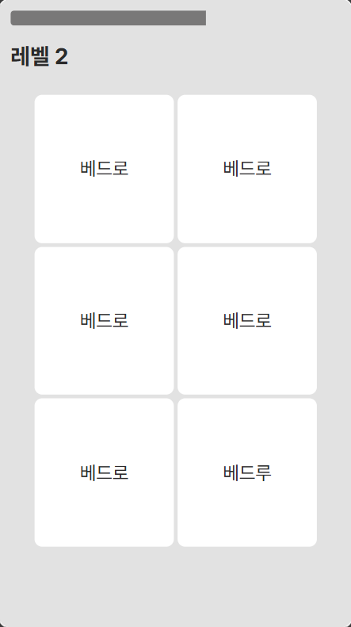

# woori-hangul

토스 한글날 이벤트 패러디 - 우리들교회 버전

## How to run

Must install

- [Node.js](https://nodejs.org/)
- [yarn](https://yarnpkg.com/)

Recommended to install

- [React devtools](https://chrome.google.com/webstore/detail/react-developer-tools/fmkadmapgofadopljbjfkapdkoienihi?hl=ko)
- [VSCode Prettier extension](https://marketplace.visualstudio.com/items?itemName=esbenp.prettier-vscode)

Install the dependencies

- Run `yarn`

Run in the development mode

- Run `yarn dev`
- Open <http://localhost:3000> on the browser

Run in the production mode

- Run `yarn build`
- Run `yarn start`

Check the code

- Run `yarn lint`
- Run `yarn lint:fix` to check & fix
